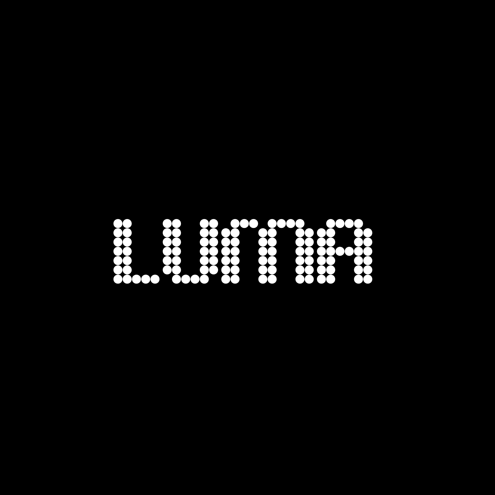

<div align="center">
  
  <h1>LUMA</h1>
  <p><strong>Image → ASCII.</strong> Minimal by design.</p>

  <p>
    
    
    
    
    
    
  </p>
</div>

LUMA is a minimal, design-first ASCII art generator.

## Quickstart

```bash
pnpm install
pnpm dev
```

Build:

```bash
pnpm build
pnpm start
```

License: MIT
