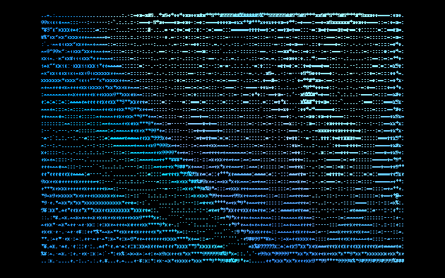
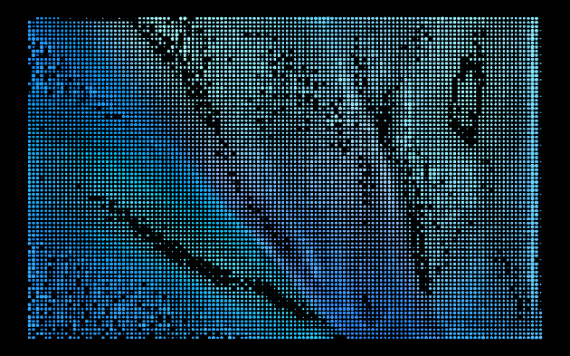
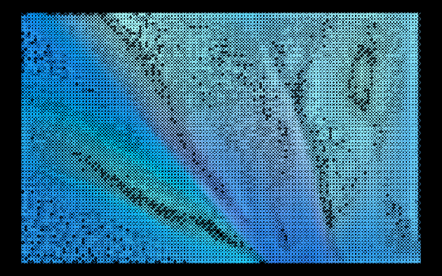
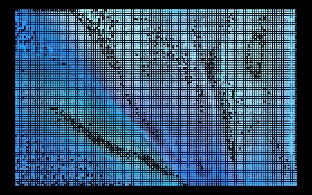
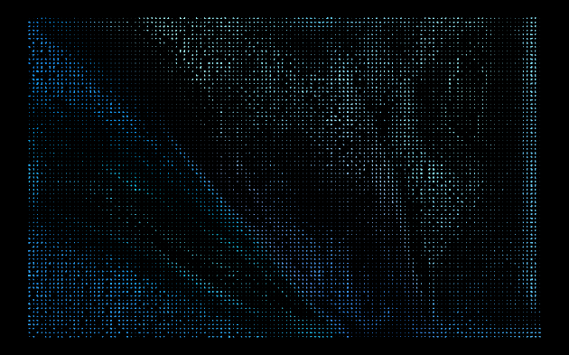
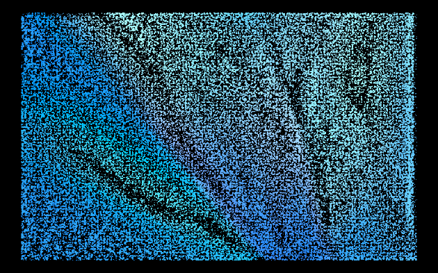
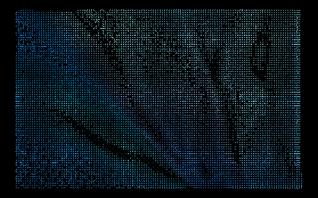

<div align="center">


# LUMA

**Image in → art out.** Seven render styles, one minimal canvas.  
Contrast, edges, and color—all in the browser.

[](https://nextjs.org/)
[](https://react.dev/)
[](https://www.typescriptlang.org/)
[](https://tailwindcss.com/)
[](https://ui.shadcn.com/)

</div>

---

## What it does

Upload a picture and pick a **render style**. LUMA samples the image on a grid, boosts local contrast and edges, then paints each cell with median color and a little vibrance. Nothing is sent to an API for conversion—your image stays on the device.

| Style | What you get |
|--------|----------------|
| **ASCII** | Classic character ramp, crisp canvas glyphs |
| **Dots** | Colored halftone circles |
| **Hatch** | Cross-hatched engraving |
| **Mosaic** | Rounded tiles with tone-driven fill |
| **Contour** | Short strokes along structure |
| **Stipple** | Weighted multi-dot clusters |
| **Halftone** | Ellipses rotated with local gradient |

Light and dark themes swap logos, banners, and export backgrounds.

---

## Gallery

Dark-theme PNG exports from the same source image—so you can see how each mode reads.

<p align="center"><sub><strong>ASCII</strong> · <strong>Dots</strong> · <strong>Hatch</strong></sub></p>

<p align="center">
  
  &nbsp;
  
  &nbsp;
  
</p>

<p align="center"><sub><strong>Mosaic</strong> · <strong>Contour</strong> · <strong>Stipple</strong></sub></p>

<p align="center">
  
  &nbsp;
  
  &nbsp;
  
</p>

<p align="center"><sub><strong>Halftone</strong></sub></p>

<p align="center">
  
</p>

---

## Quickstart

```bash
npm install
npm run dev
```

Open [http://localhost:3000](http://localhost:3000).

Production build:

```bash
npm run build
npm start
```

---

## License

MIT
